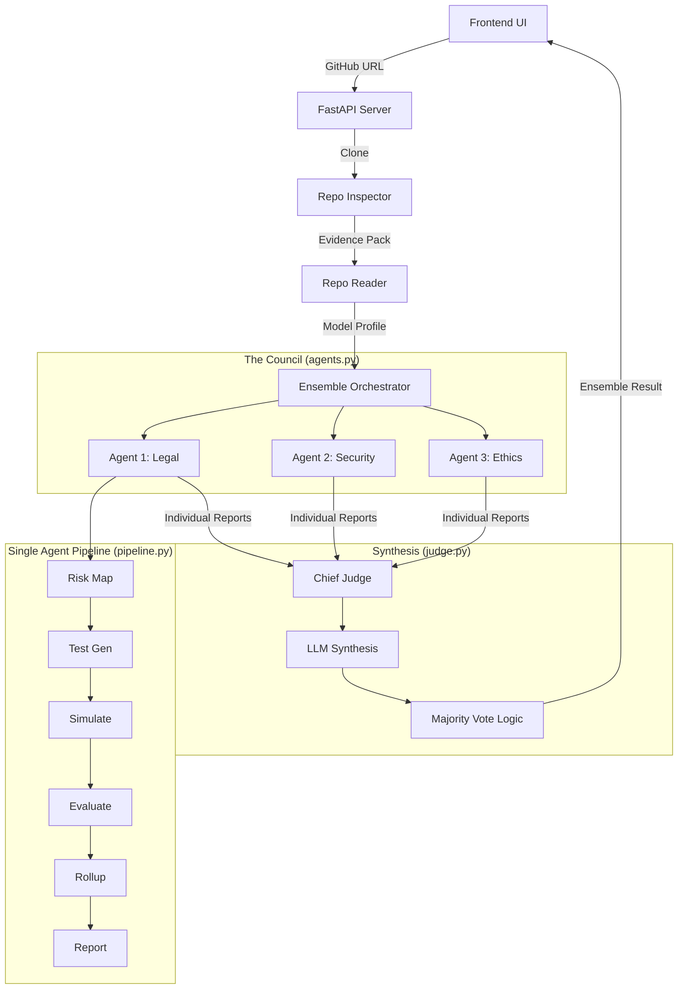

# UNICC AI Safety Lab

Multi-agent AI safety evaluation platform. Submit an AI agent (via GitHub URL or manual description) and receive independent safety assessments from three expert modules grounded in different frameworks (EU AI Act, OWASP Top 10 for LLMs, UNESCO AI Ethics), plus a synthesized council verdict.

**Authors:** Sharon Cherian, Andrea Leon

## Quick Start

### Prerequisites
- Python 3.11+
- Git (required for cloning repositories during evaluation)
- API key for either Anthropic or Groq 

### Installation
```bash
git clone https://github.com/ysherpa26/UNICC-Capstone.git
cd UNICC-Capstone
pip install -r requirements.txt
```

### Configuration
```bash
cp .env.example .env
```
Open `.env` and add your API key:
```
ANTHROPIC_API_KEY=your_key_here
```
Or for Groq:
```
GROQ_API_KEY=your_key_here
```
**Per-agent model selection (Groq only).** When running with `GROQ_API_KEY`, you can override which Groq model each of the three expert agents uses via the `AGENT_1_MODEL`, `AGENT_2_MODEL`, and `AGENT_3_MODEL` environment variables. We recommend the 3 best Groq models to be: `openai/gpt-oss-120b`, `openai/gpt-oss-20b`, and `openai/gpt-oss-safeguard-20b`. Sensible defaults are provided in `.env.example`. When running with `ANTHROPIC_API_KEY`, all three agents use Claude and these overrides are ignored. Before changing defaults, verify the model IDs against the current Groq production model list at https://console.groq.com/docs/models — Groq deprecates older models periodically.

### Run
```bash
python server.py
```

Expected output on successful startup:
```
[config] Using Groq API (default model: openai/gpt-oss-20b)
Server running at http://localhost:8000
INFO:     Uvicorn running on http://0.0.0.0:8000 (Press CTRL+C to quit)
```

### Submit an AI Agent for Evaluation
1. Open http://localhost:8000 in your browser
2. Paste a GitHub URL (e.g., `https://github.com/FlashCarrot/VeriMedia`) OR fill in the manual form
3. Click "Evaluate"
4. Results appear in ~60 seconds

## Project Structure

| File | Purpose |
|------|---------|
| `server.py` | FastAPI server, serves UI and `/api/evaluate` endpoint |
| `config.py` | LLM gateway, auto-detects Anthropic/Groq from environment |
| `schemas.py` | Pydantic validation for all input/output JSON |
| `pipeline.py` | 6-stage evaluation pipeline (3 agents × 4 LLM calls each) |
| `agents.py` | Framework-specific prompt definitions (EU AI Act, OWASP, UNESCO) |
| `judge.py` | Council synthesis: LLM narrative + deterministic verdict enforcement |
| `repo_reader.py` | Extracts model profile from GitHub repositories via LLM |
| `templates/index.html` | Web UI with progressive disclosure (L1/L2/L3) |
| `.env.example` | Environment variable template |

## Environment Variables

| Variable | Required | Description |
|---|---|---|
| `ANTHROPIC_API_KEY` | One of these | Anthropic API key (recommended) |
| `GROQ_API_KEY` | Required | Groq API key (alternative) |
| `MOCK_MODE` | No | Set to `1` to skip LLM calls and return mock data |

## Architecture

Three independent expert agents evaluate the submitted AI system through different safety frameworks. Each agent runs the same 6-stage pipeline (risk mapping → test case generation → target simulation → response evaluation → rollup → compliance report) but with framework-specific prompts. A judge module synthesizes the three assessments into a final APPROVE / REVIEW / REJECT verdict with confidence score, disagreement analysis, and deliberation log.

### Data Flow



## API Endpoints

| Method | Path | Description |
|---|---|---|
| `GET` | `/` | Web interface |
| `GET` | `/api/health` | Server status and detected LLM provider |
| `POST` | `/api/evaluate` | Submit agent for evaluation (accepts `github_url` or `model_profile` JSON) |

## Troubleshooting

### `PROFILE_EXTRACTION_FAILED`
This usually happens if the GitHub URL is invalid or if the LLM cannot parse the repository structure. 
- **Fix**: Verify the URL is public and accessible. Check terminal logs for `repo_inspector` errors.

### `PIPELINE_FAILED`
The evaluation crashed. This is often due to API rate limits (especially on Groq's free tier) or context window overflow.
- **Fix**: Switch to Anthropic (preferred for evaluation) via ANTHROPIC_API_KEY.

### Agent Modules Not Loading
If you see `Pipeline modules failed to load`, ensure all dependencies in `requirements.txt` are installed and you are running from the project root.

---
